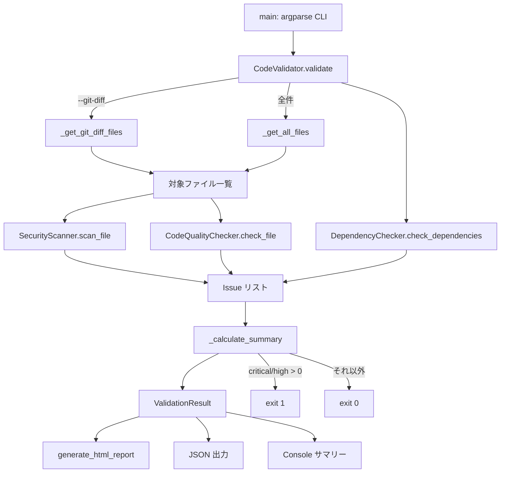

# アーキテクチャ (Architecture)

code-validator は **単一ファイルのモノリシック CLI** です。すべての実装はリポジトリ
ルートの `validator.py`（約 946 行）に収まっており、外部依存は `pydantic` のみ、
ネットワーク通信は一切行いません（依存関係監査でオプションの `pip-audit` / `npm audit`
を呼ぶ場合を除く）。完全オフラインで動作することが設計上の中心要件です。

> 出典: `validator.py`、`spec.md`、`CLAUDE.md`。

---

## 設計目標 (Design Goals)

| 目標 | 実現方法 |
|---|---|
| 完全オフライン | ソースコードを外部に送らない。CVE 照会のみ `pip-audit` / `npm audit` に委譲 |
| 最小依存 | コア依存は `pydantic==2.13.4` のみ（`requirements.txt`） |
| CI フレンドリ | Critical / High 検出時に終了コード `1` を返しジョブをブロック |
| 高速 | `--git-diff` で変更ファイルのみスキャン |
| AI 生成コード特化 | LLM がよく出す `allow_origins=["*"] + allow_credentials=True` 等を狙い撃ち |

---

## コンポーネント構成 (Components)

すべて `validator.py` 内のクラス / 関数です。

| コンポーネント | 種別 | 位置 (validator.py) | 役割 |
|---|---|---|---|
| `Severity` | Enum | `class Severity` | 重大度 5 段階（critical / high / medium / low / info） |
| `Issue` | dataclass | `class Issue` | 検出結果 1 件（severity / category / file_path / line_number / rule_id / message ほか） |
| `ValidationResult` | dataclass | `class ValidationResult` | 1 回のスキャン結果全体（issues リスト + サマリー + 実行時間） |
| `SecurityScanner` | クラス | `class SecurityScanner` | SEC001–SEC007。認証情報 / CORS / SQLi / セキュリティヘッダーを検出 |
| `CodeQualityChecker` | クラス | `class CodeQualityChecker` | QUAL001。行長・未使用 import・関数複雑度（スタブ） |
| `DependencyChecker` | クラス | `class DependencyChecker` | DEP001–DEP003。`pip-audit` / `npm audit` へ委譲 |
| `CodeValidator` | クラス | `class CodeValidator` | オーケストレータ。設定読込・ファイル収集・各スキャナ実行・集計 |
| `generate_html_report` | 関数 | `def generate_html_report` | HTML レポート（色分けされた重大度カード）を生成 |
| `main` | 関数 | `def main` | argparse による CLI エントリポイント。JSON 出力と Console サマリーを担当 |

補助メソッド（`CodeValidator` 内）:
- `_load_config` — 設定ファイル（`config/validator_config.json`）の読込。
- `_get_all_files` — 対象拡張子のファイルを再帰収集（`node_modules` / `venv` / `__pycache__` / `.git` を除外）。
- `_resolve_diff_base` / `_get_git_diff_files` — `git diff --name-only` による差分ファイル収集。
- `_calculate_summary` — 重大度別の件数集計。

`src/` は `__init__.py` のみのプレースホルダで、現状の実体は `validator.py` 単体です。

---

## データフロー (Data Flow)

処理の流れ:
1. `main` が引数を解釈し `CodeValidator` を生成（`--config` 指定時はカスタム設定を読込）。
2. `validate` が対象ファイルを収集。`--git-diff` なら差分のみ、それ以外は全件。`validator.py` 自身はスキャン対象から除外される。
3. セキュリティスキャンは `.py / .js / .ts / .tsx / .json` を対象、品質チェックは `.py` のみ、依存監査はプロジェクト全体を対象に実行。
4. すべての `Issue` を集約し、重大度別に `summary` を作成して `ValidationResult` を返す。
5. `--output` 指定時に HTML または JSON を書き出し、常に Console へサマリーを表示。
6. Critical または High が 1 件以上あれば終了コード `1`、なければ `0`。

---

## セキュリティ設計上の注意点 (Hardening Notes)

差分ベースのスキャンには、コード内コメントで明示された防御が組み込まれています。

- **PATH-TRAV-001**: `git diff` が返すパスを `resolve()` で正規化し、プロジェクトルート配下のもののみ許可。悪意あるコミットの `../../etc/passwd` 等を排除。
- **DOS-001**: 外部プロセス呼び出し（`git diff`）に 30 秒の `timeout` を必須化。
- **差分ベース解決失敗時のフォールバック**: ベースを解決できない場合は `HEAD` 比較にフォールバックしつつ警告を出す（CI で `fetch-depth: 0` 不足により 0 ファイルになる事故を可視化）。
- **CORS-REGEX-001**: `wildcard_with_credentials` 検出の正規表現を修正済み（CHANGELOG / git log 参照）。

---

## 技術選定 (Tech Choices)

| 選定 | 理由（出典: `plan.md` 決定事項ログ / `CLAUDE.md`） |
|---|---|
| Python 3.9+ | 標準ライブラリ中心で追加依存を最小化 |
| `pydantic` のみ依存 | 軽量・ゼロ依存に近い構成を重視 |
| `pip-audit` / `npm audit` へ委譲 | 依存関係 CVE チェックは専門ツールに任せ、本体は薄く保つ |
| 正規表現ベースの静的検出 | AST 構築なしで高速、AI 生成コードの既知パターンに最適化 |
| 終了コード 0 / 1 | CI/CD パイプラインでのブロック判定にそのまま使える |
| HTML テンプレートを文字列内包 | レポート生成に追加のテンプレートエンジン依存を持ち込まない |

---

## 既知の制約と拡張ポイント (Limitations & Extension Points)

- `--format markdown` は CLI で受理されますが、`main` の出力分岐は HTML / JSON のみ実装済みで、Markdown は未実装です（`plan.md` Phase 2）。
- 関数複雑度チェック（`_check_complex_functions`）はスタブで、サイクロマティック複雑度は未実装です。
- 未使用 import 検出はヒューリスティックです（厳密解析は flake8 等を併用）。
- テストは `tests/test_cors_patterns.py` のみ。ルール追加時はここを起点にテストを拡充してください。

新しい検出ルールを追加する場合は、対応するスキャナクラス（`SecurityScanner` /
`CodeQualityChecker` / `DependencyChecker`）にメソッドを追加し、新しい `rule_id` を
付与した `Issue` を返すのが基本パターンです。仕様は `spec.md` と `specs/` に追記してください。
